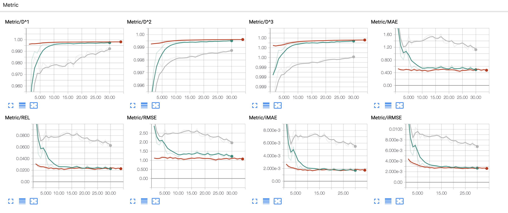
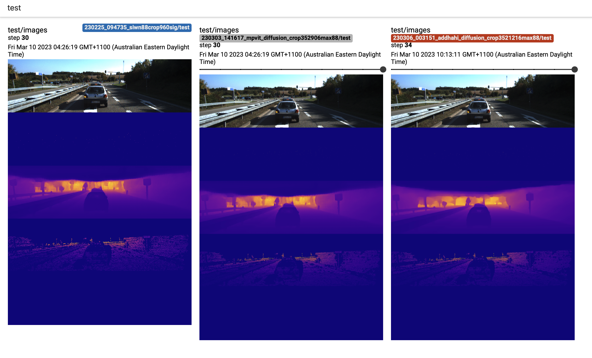

<div align="center">


# DiffusionDepth
**A guided diffusion approach for monocular depth estimation.**

______________________________________________________________________

<p align="center">
  <a href="https://arxiv.org/abs/2303.05021">Arxiv</a> •
  <a href="#dependencies">Installation</a> •
    <a href="#dataset">Dataset</a> •
<a href="#training">Training</a> •
<a href="#testing">Testing</a> •
  <a href="#pre-trained-models-and-results">Logs</a> •
  <a href="#citation">Citation</a><br>
 </p>

[]()
[](https://github.com/duanyiqun/DiffusionDepth/blob/main/LICENSE)

______________________________________________________________________

<br>


</div>

Monocular depth estimation is a challenging task that
predicts the pixel-wise depth from a single 2D image. We propose DiffusionDepth, a new
approach that reformulates monocular depth estimation as
a denoising diffusion process. It learns an iterative denoising process to ‘denoise’ random depth distribution into a
depth map with the guidance of monocular visual conditions. The process is performed in the latent space encoded by a dedicated depth encoder and decoder. Instead
of diffusing ground truth (GT) depth, the model learns to reverse the process of diffusing the refined depth of itself into
random depth distribution. This self-diffusion formulation
overcomes the difficulty of applying generative models to
sparse GT depth scenarios. 

### Citation


```
@misc{duan2023diffusiondepth,
      title={DiffusionDepth: Diffusion Denoising Approach for Monocular Depth Estimation}, 
      author={Yiqun Duan and Xianda Guo and Zheng Zhu},
      year={2023},
      eprint={2303.05021},
      archivePrefix={arXiv},
      primaryClass={cs.CV}
}
```


---------------------------------------------------------------------------------
Updates:

- The pretrained model of KITTI dataset is released.
- Rank 4th (SLog), 2th (iRMSE), 3th (sqErrorRel) on  on the official KITTI leaderboard 


### Dependencies

Especially thanks to [nlspn](https://github.com/zzangjinsun/NLSPN_ECCV20) with there excellent work. This code base borrow borrow frameworks to accelerate implementation. 

Our released implementation is tested on:

- Ubuntu 16.04 / Ubuntu 18.04
- Python 3.9.13 (conda-build 22.9.0)
- PyTorch 1.10 / torchvision 1.11.0
- Tensorboard 2.3
- NVIDIA CUDA 11.4
- NVIDIA Apex
- 8x NVIDIA GTX 3090 / 8x NVIDIA A100 RTX GPUs
- mmdet3d

Please see the official [instruction](https://github.com/open-mmlab/mmdetection3d/blob/master/docs/en/getting_started.md) to install mmdet3d. Apologize for any inconvenience caused by version incompatibilities (as mentioned in the issues) when installing this library. To address the issue, please check out mmdet3d==0.15.0 and then execute a local installation.
Basically it's better to clone the repo to install rather than use conda. 

```shell
$ cd DiffusionDepth
$ pip install -r requirements.txt
```

The requirements.txt might be slight different on different machines. If you can't find a specific version, please try pip install related version first. 

#### NVIDIA Apex

NVIDIA Apex is a good choice for multi-GPU training to save GPU memory. However we only use option "O0" to train the work. Wellcome to discuss with us about half precision performance. 
Apex can be installed as follows:

```bash
$ cd PATH_TO_INSTALL
$ git clone https://github.com/NVIDIA/apex
$ cd apex
$ pip install -v --no-cache-dir --global-option="--cpp_ext" --global-option="--cuda_ext" ./ 
```

---------------------------------------------------------------------------------


### Dataset

We used two datasets for training and evaluation. Please also see [nlspn](https://github.com/zzangjinsun/NLSPN_ECCV20) with there excellent work on data processing.  

#### NYU Depth V2 (NYUv2)

We used preprocessed NYUv2 HDF5 dataset provided by [Fangchang Ma](https://github.com/fangchangma/sparse-to-dense).

```bash
$ cd PATH_TO_DOWNLOAD
$ wget http://datasets.lids.mit.edu/sparse-to-dense/data/nyudepthv2.tar.gz
$ tar -xvf nyudepthv2.tar.gz
```
After preparing the dataset, you should generate a json file containing paths to individual images.

```bash
$ cd DiffusionDepth/utils
$ python generate_json_NYUDepthV2.py --path_root PATH_TO_NYUv2
```
After that, you will get a data structure as follows:

```
nyudepthv2
├── train
│    ├── basement_0001a
│    │    ├── 00001.h5
│    │    └── ...
│    ├── basement_0001b
│    │    ├── 00001.h5
│    │    └── ...
│    └── ...
└── val
    └── official
        ├── 00001.h5
        └── ...
```

#### KITTI Depth Prediction (KITTI DP)

KITTI DP dataset is available at the [KITTI Website](http://www.cvlibs.net/datasets/kitti). We should choose depth prediction for re-implementation. 

For color images, KITTI Raw dataset is also needed, which is available at the [KITTI Raw Website](http://www.cvlibs.net/datasets/kitti/raw_data.php).
Please follow the official instructions (cf., devkit/readme.txt in each dataset) for preparation.
After downloading datasets, you should first copy color images, poses, and calibrations from the KITTI Raw to the KITTI Depth dataset.

```bash
$ cd DiffusionDepth/utils
$ python prepare_KITTI_DP.py --path_root_dc PATH_TO_Dataset --path_root_raw PATH_TO_KITTI_RAW
```

```
.
├── depth_selection
│    ├── test_depth_completion_anonymous
│    │    ├── image
│    │    ├── intrinsics
│    │    └── velodyne_raw
│    ├── test_depth_prediction_anonymous
│    │    ├── image
│    │    └── intrinsics
│    └── val_selection_cropped
│        ├── groundtruth_depth
│        ├── image
│        ├── intrinsics
│        └── velodyne_raw
├── train
│    ├── 2011_09_26_drive_0001_sync
│    │    ├── image_02
│    │    │     └── data
│    │    ├── image_03
│    │    │     └── data
│    │    ├── oxts
│    │    │     └── data
│    │    └── proj_depth
│    │        ├── groundtruth
│    │        └── velodyne_raw
│    └── ...
└── val
    ├── 2011_09_26_drive_0002_sync
    └── ...
```

After preparing the dataset, you should generate a json file containing paths to individual images.

```bash
$ cd DiffusionDepth/utils

# For Train / Validation
$ python generate_json_KITTI_DP.py --path_root PATH_TO_KITTI

# For Online Evaluation Data
$ python generate_json_KITTI_DP.py --path_root PATH_TO_KITTI --name_out kitti_dp_test.json --test_data
```


### Training

Notes, recomended to download pretrain from Swin transformer official website and modify the backbone file [src/model/backbone/swin.py](src/model/backbone/swin.py) replacing the pretrain path to your local copy.

```bash
$ cd DiffusionDepth/src
# An example command for KITTI dataset training
$ ppython main.py --dir_data datta_path --data_name KITTIDC --split_json ../data_json/kitti_dp.json \
     --patch_height 352 --patch_width 906 --gpus 0,1,2,3 --loss 1.0*L1+1.0*L2+1.0*DDIM --epochs 30 \
     --batch_size 8 --max_depth 88.0 --save NAME_TO_SAVE \
     --model_name Diffusion_DCbase_ --backbone_module swin --backbone_name swin_large_naive_l4w722422k --head_specify DDIMDepthEstimate_Swin_ADDHAHI 
```

A fast verification with res50 backbone.
```bash
$ python main.py --dir_data datta_path --data_name KITTIDC --split_json ../data_json/kitti_dp.json \
     --patch_height 352 --patch_width 706 --gpus 4,5,6,7 --loss 1.0*L1+1.0*L2+1.0*DDIM --epochs 30 \
     --batch_size 4 --max_depth 88.0 --num_sample 0 --save NAME_TO_SAVE \
     --model_name Diffusion_DCbase_ --backbone_module mmbev_resnet --backbone_name mmbev_res50 --head_specify DDIMDepthEstimate_Res
```

Please refer to the config.py for more options. Including the control of the denoising steps ```--inference_steps=20``` and training diffusion steps ```--num_train_timesteps=1000```.


Best checkpoint on KITTI depth test split offline, we provide finetune metric logs in [experiments](experiments)
```shell
0022 |  Metric   |  RMSE: 1.0787  MAE: 0.4806  iRMSE: 0.0026  iMAE: 0.0017  REL: 0.0227  D^1: 0.9982  D^2: 0.9996  D^3: 0.9999
```

During the training, tensorboard logs are saved under the experiments directory. To run the tensorboard:

```bash
$ cd DiffusionDepth/experiments
$ tensorboard --logdir=. --bind_all
```
The tensorboard visualization includes metric curves and depth map visualization as shown below.





### Testing
With only batch size 1 is recomended. 
```bash
$ cd DiffusionDepth/src

# An example command for KITTI DC dataset testing
$ python main.py --dir_data PATH_TO_KITTI_DC --data_name KITTIDC --split_json ../data_json/kitti_dp.json \
    --patch_height 352 --patch_width 1216 --gpus 0,1,2,3 --max_depth 80.0 --num_sample 0 --batch_size 1\
    --test_only --pretrain PATH_TO_WEIGHTS --save NAME_TO_SAVE --save_image\
    --model_name Diffusion_DCbase_ --backbone_module swin --backbone_name swin_large_naive_l4w722422k --head_specify DDIMDepthEstimate_Swin_ADDHAHI 
```


### Pre-trained Models and Results

We provide the pre-trained models and results on KITTI depth prediction test split.

<div align="center">


|    Model    | RMSE  | MAE | iRMSE     |  iMAE    |REL| D<sup>1</sup> |  D<sup>2</sup>    |   D<sup>3</sup>     |      
|----------|:-------------:|:----:|:----:|:----:|:-------------:|:----:|:----:|:----:|
|   [Res50](https://huggingface.co/claudecc/diffusiondepth/blob/main/res50_model_00030.pt) | 1.7232 | 0.8713 | 0.0066  | 0.0041 | 0.0496 | 0.9872 | 0.9977  | 0.9992 |
|  [Swin](https://huggingface.co/claudecc/diffusiondepth/blob/main/swin_model_00035.pt) |     0.9801    | 0.4254 | 0.0025 | 0.0016 |    0.0207    | 0.9983 | 0.9996 |0.9999
| [MpVit](https://huggingface.co/claudecc/diffusiondepth/blob/main/mpvit_model_00037.pt)    |      1.1502     |0.4788  | 0.0029 | 0.0018 |      0.0229     | 0.9978| 0.9996 | 0.9998 |


</div>

#### Notes

Especially thanks to [nlspn](https://github.com/zzangjinsun/NLSPN_ECCV20) with there excellent work. This code base borrow borrow frameworks to accelerate implementation. 
